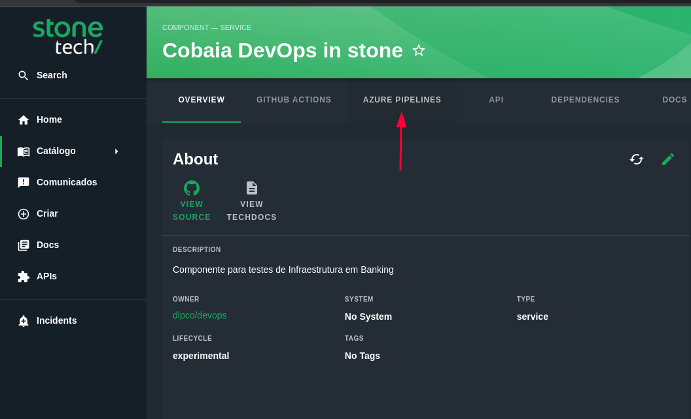
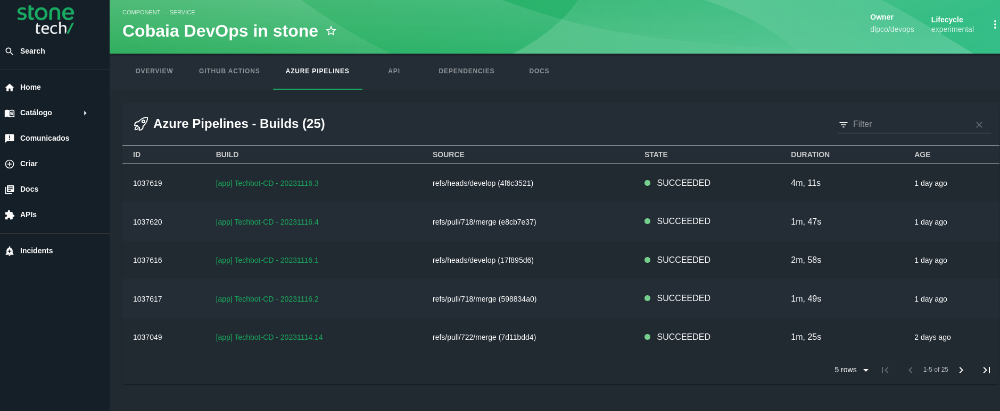

# Plugins: Azure Devops Pipelines

Este plugin permite para o componente cadastrado a visualização das pipelines de CI/CD da ferramenta [**Azure Pipelines**](https://github.com/backstage/backstage/blob/master/plugins/azure-devops/README.md#azure-pipelines).





## Como habilitar

Para habilitar o plugin para o seu componente é preciso adicionar as *annotations* abaixo no componente descrito pelo arquivo *catalog-info.yaml*:
- dev.azure.com/project: PROJECT_NAME
- dev.azure.com/build-definition: PIPELINE_NAME

```yaml
apiVersion: backstage.io/v1alpha1
kind: Component
metadata:
  name: stone-example-app
  description: Stone Example App with Azure Pipelines
  annotations:
    dev.azure.com/project: DevOps
    dev.azure.com/build-definition: homolog-aws-us-east-1-ec2-newrelic-agent-camel
```
